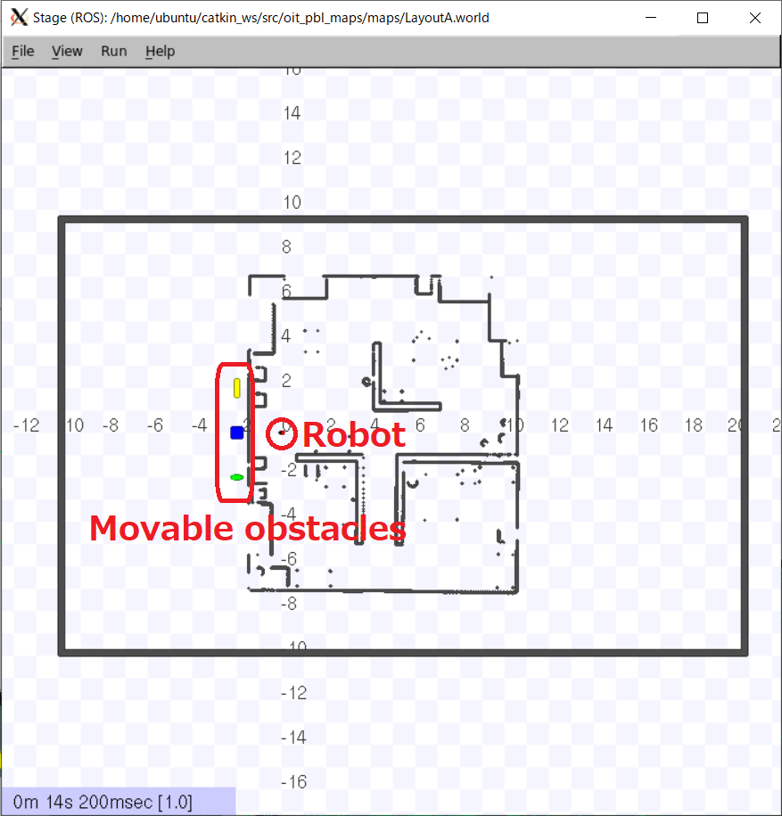
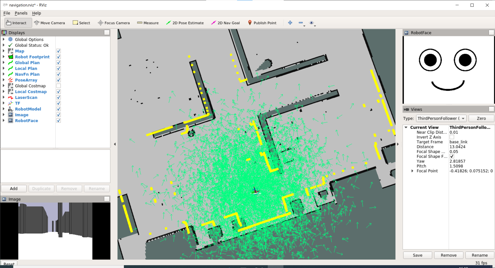

# Preparation

[README](../README.md)

---

## Installation of softwares for robot group

```shell
$ cd catkin_ws/src/
$ git clone https://github.com/KMiyawaki/oit_pbl_ros_samples.git
$ git clone https://github.com/KMiyawaki/oit_stage_ros.git
$ git clone https://github.com/KMiyawaki/oit_pbl_maps.git
$ cd ~/catkin_ws && catkin_make
```

## Check robot simulator

```shell
$ roslaunch oit_stage_ros navigation.launch
```

### Explanations of GUI windows

- Simulation world generated by [`Stage`](https://github.com/rtv/Stage). [`Stage`](https://github.com/rtv/Stage) is a light-weight robotics simulator.



- `RViz`
  - Visualization software of `ROS`, which shows map, robot, robot's face, virtual camera's view and laser range finder's data (yellow points).



#### Checkpoint(simulator)

- It's OK, you can run the simulator.

## Test autonomus robot navigation

`Navigation` means autonomus robots' movements, which consists of following 2 steps.

1. Localization with a laser range finder and a map.
2. Autonomus movements to the designated position with obstacle avoidance.

`ROS` provides the functionalities through `Navigation meta-package`.

- cf. [ROS navigation](http://wiki.ros.org/navigation)

### Localization

A `ROS` robot can estimate its position and orientation on a room by matching between pre-obtained map shape and laser range finder's data.

- At first, you should drag the robot, that is a red block on the `Stage`.

Press `2D Pose Estimate` button on the `RViz`, and drag the arrow from the correct position on the map to correct direction of the robot.


It's OK when laser range finder's data (yellow points) matched the shape of the map raughly.

#### **Imortant notice**

Localization is not necessary, because our simulator will finish localization while boot process.

### Indicate navigation goal

Press `2D Nav Goal` on the `RViz`, and drag from desired goal postion to desired robot direction.


#### Checkpoint(navigation)

- It's OK, you can use the navigation.

### Move the robot and obstacle blocks on the Stage

You can drag the robot and colored obstacle blocks on the `Stage`.


#### Checkpoint(move the objects)

- It's OK, you can move objects on the `Stage`.

## Robot's facial expression

1. Run robot simulator. `roslaunch oit_stage_ros navigation.launch`.
    - The command launch `~catkin_ws/src/oit_stage_ros/scripts/face_image_publisher.py`, which publishes face image.
    - You can see the robot's face on the `RViz`.
2. Open another terminal and type `rostopic pub /robot_face_type std_msgs/String "data: 'happy'" -1`, that changes robot's face.
    - You can use `'sad'` or `'normal'` alternatively.


### Checkpoint(change the face)

- It's OK, you can change the Robot's face.

## Referecne

- [How to Use Player/Stage](http://player-stage-manual.readthedocs.io/en/stable/)

---

[README](../README.md)
