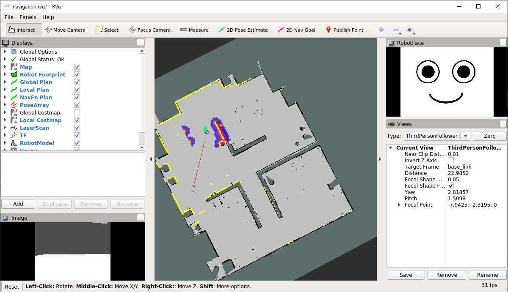
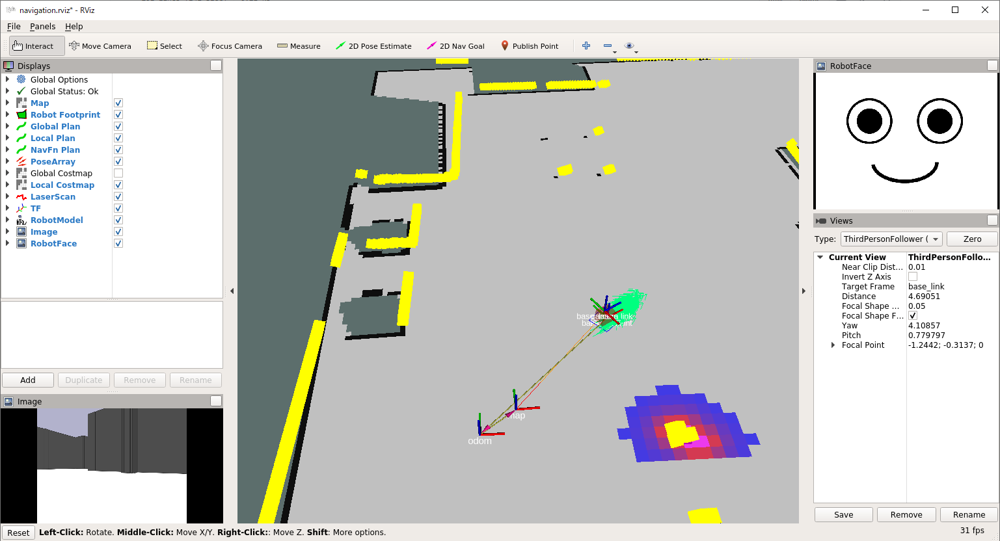

# Robot control (3)

[README](../README.md)

---

## Objectives

This page explains how to make make a program for autonomus navigation.

## Prerequisite

You have to finish [Robot control (2)](robot_control/robot_control_02.md).

## ROS navigation

Using the [`ROS navigation`meta-package](http://wiki.ros.org/navigation), it is very simple to make a navigation program.  
We have learned to use `/cmd_vel` topic for velocity control. It is useful to make simple robot movement. On the other hand, `ROS navigation` presents functionalties including global path planning and obstacle avoidance for autonomus navigation.  The node `move_base` provides the functionalities. Your program will use the `move_base` with following procedures,

1. Connect `move_base`.
2. Wait until connection to `move_base`.
3. Send navigation goal to the `move_base` and wait the result.

## Practice [Simple navigation]

Make a python file inside of the `oit_pbl_ros_samples` package.  
Open a linux terminal emulator. See [Use terminal Emulator in the ROS Container](https://github.com/oit-ipbl/portal/blob/main/setup/dockerros.md#use-terminal-emulator-in-the-ros-container), and input the following commands.

```shell
$ roscd oit_pbl_ros_samples/scripts
$ pwd
/home/ubuntu/catkin_ws/src/oit_pbl_ros_samples/scripts
$ touch navigation.py
$ chmod u+x navigation.py
```

Edit the `navigation.py`.

- Open `~/catkin_ws/src/oit_pbl_ros_samples/` by Visual Studio Code editor, and edit `navigation.py`.

Type the following template. It's OK copy and paste.

```python
#!/usr/bin/env python
# -*- coding: utf-8 -*-

import math # for math.radians
import os
import actionlib
import rospy
from move_base_msgs.msg import MoveBaseAction
from utils import navigation


class Navigation(object):
    def __init__(self):
        self.move_base_name = "move_base"

    def process(self):
        # connect to move_base action server
        ac = actionlib.SimpleActionClient(self.move_base_name, MoveBaseAction)
        # wait until connnect to move_base action server
        while not ac.wait_for_server(rospy.Duration(5)):
            rospy.loginfo("Waiting for the move_base action server to come up")
        rospy.loginfo("The server comes up")
        # send navigation goal x, y, theta
        navigation(ac, 3, 3.6, math.radians(90)) # convert degrees to radians


def main():
    script_name = os.path.basename(__file__)
    rospy.init_node(os.path.splitext(script_name)[0])
    rospy.sleep(0.5)  # rospy.Time.now() returns 0, without this sleep.

    node = Navigation()
    rospy.loginfo("%s:Started", rospy.get_name())

    node.process()
    rospy.loginfo("%s:Exiting", rospy.get_name())


if __name__ == '__main__':
    try:
        main()
    except Exception as e:
        rospy.logerr("%s:%s", rospy.get_name(), str(e))
        exit(1)

```

### Run

At first, launch the simulator.

```shell
$ roslaunch oit_stage_ros navigation.launch
```

After a while run the `navigation.py`.

- Carefully check the screen of `Rviz`.
- Planned global path will appear as a red curve, and the robot go to the designated goal.
- The warning message like `the rosdep view is empty: call 'sudo rosdep init' and 'rosdep update'` may appear, but it's OK.

```shell
$ rosrun oit_pbl_ros_samples navigation.py
[INFO] [1623923395.698720, 22.600000]: /navigation:Started
[INFO] [1623923395.984657, 22.800000]: The server comes up
[INFO] [1623923395.990364, 22.800000]: /navigation:Sending goal
[INFO] [1623923417.510848, 44.400000]: /navigation:Finished: (3)
[INFO] [1623923417.513398, 44.400000]: /navigation:Exiting
```



- If your robot stucks open linux terminal emulator and run the following command. The command will re-start `move_base` node.

```shell
$ rosnode kill move_base
killing /move_base
killed
```

## Exercise (robot control 3-1)

- Make arbitrary navigation goals, about 4 points, and make a program to navigate to the goals sequencialy.
- You can get coordinate of the arbitrary point on the map from `RViz` with the following procedure.

### How to get coordinate of the arbitrary points on the map

`Publish Point` button on the `RViz` can be used.
Open a new terminal emulator and type the command.

```shell
$ rostopic echo /clicked_point
WARNING: no messages received and simulated time is active.
Is /clock being published?
```

Press `Publish Point` on the `RViz`. After that click an arbitrary point on the map.


The following information of the map points will be shown on the emulator used to run the `rostopic echo /clicked_point` command.  
You can use the `x` and `y` values.

```shell
$ rostopic echo /clicked_point
WARNING: no messages received and simulated time is active.
Is /clock being published?
header:
  seq: 4
  stamp:
    secs: 491
    nsecs: 500000000
  frame_id: "map"
point:
  x: 17.6272621155
  y: -0.0404167175293
  z: -0.00174522399902
---
```

- ***Important points***
  - Do not use `Stage` to get coordinates.

### Additional explanation for robot's direction

Check this code.

```python
        # send navigation goal x, y, theta
        navigation(ac, 3, 3.6, math.radians(90))
```

The third argument is a desired direction of the robot which have reached to the navigation goal.
In this case, the 'direction' will represents the angle on the 'map' coordinate system.

If you have computer graphics knowledge, you may rephrase 'map' coordinate system as the 'world' coordinate system.

The angle represents with -180 degrees to +180 degrees.  
Zoom up the `RViz` screen and you can see an axis named `map`. The X (red) axis is zero degree, and counter clockwise direction is plus angles.



## Checkpoint(robot navigation programming)

- It's OK, you can finish the question 1.

## Question (robot control 3)

- Change the third argument of the following code, and check the direction which the robot faces when the navigation finished.

```python
        # send navigation goal x, y, theta
        navigation(ac, 3, 3.6, math.radians(90))
```

---

[README](../README.md)
